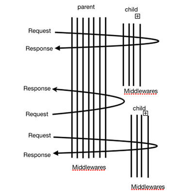

# micro-fe

基于 koa 的 服务模块化

koa 可以理解为这样


或者


micro-fe 可以理解位 多个 koa 的组合



## 安装 install

```
npm install micro-fe --save
```

## 使用 usage

详细使用参见 [example](./example)

```javascript
const Koa = require('Koa')
const MicroFe = require('../index')
const app = new Koa()
const mfvm = new MicroFe(app)

//  有序插入中间件
// 可以通过 mfvm.middlewareName来查看中间件情况，调整插入位置，
// 也可以通过 mfvm.use({name, middleware}) , 默认添加到最后边
mfvm.insert(0, {
  name: 'test',
  middleware: async (ctx, next) => {
    await await (() =>
      new Promise((resolve, reject) => {
        // 自运行返回Promise
        setTimeout(() => {
          ctx.testparam = 1
          console.log('test123')
          resolve()
        }, 500)
      }))()
    await next()
  }
})

// 还有mfvm.post,... 支持方法参见https://github.com/jshttp/methods， node支持的都支持
mfvm.get('/api/:id', async function(ctx) {
  ctx.body = ctx.params.id
})
mfvm.get('/', async function(ctx) {
  ctx.body = {
    hello: 'world',
    name: ctx.testparam
  }
})

// 注册子服务
mfvm.register('/sub', async function(mfvm) {
  // 中间件
  mfvm.use({
    name: 'subtest',
    middleware: async (ctx, next) => {
      await await (() =>
        new Promise((resolve, reject) => {
          setTimeout(() => {
            ctx.testparam = 2
            console.log('subtest123')
            resolve()
          }, 500)
        }))()
      await next()
    }
  })

  mfvm.get('/api', async function(ctx) {
    ctx.body = {
      sub: 'api',
      name: ctx.testparam
    }
  })
})

app.use(mf.routes())

app.listen(3000)
```

## 方法以及属性

### 路由

```javascript
const app = new Koa()
const mfvm = new MicroFe(app)
mfvm
  .get('/api/:id', async function(ctx) { // 非 async function 也OK
    ctx.body = ctx.params.id
  })
  .post('/api2/:id', async function(ctx) {
    ctx.body = ctx.params.id
  })
```

### 中间件

```javascript
const app = new Koa()
const mfvm = new MicroFe(app)
//  有序插入中间件
// 可以通过 mfvm.middlewareName来查看中间件情况，调整插入位置，
// 也可以通过 mfvm.use({name, middleware}) , 默认添加到最后边
mfvm.insert(0, {
  name: 'test',
  middleware: async (ctx, next) => {
    await await (() =>
      new Promise((resolve, reject) => {
        // 自运行返回Promise
        setTimeout(() => {
          ctx.testparam = 1
          console.log('test123')
          resolve()
        }, 500)
      }))()
    await next()
  }
})
mfvm.use({
  name: 'subtest',
  middleware: async (ctx, next) => {
    await await (() =>
      new Promise((resolve, reject) => {
        setTimeout(() => {
          ctx.testparam = 2
          console.log('subtest123')
          resolve()
        }, 500)
      }))()
    await next()
  }
})
```
### 获取指定中间件名的位置

```javascript
const index = mfvm.indexOfMiddleware(middlewareMame)
```

### 扩展ctx

```javascript
const app = new Koa()
const mfvm = new MicroFe(app)
mfvm.decorateCTX('extends1', async function(ctx) { // 非 async function 也OK
  // 你的代码
})
```
### 注册子服务

参见 [example](./example)


### app koa 实例

```javascript
this.app // koa实例
```

### prefix: path 前缀

```javascript
this.prefix // path前缀，跟实例为空
```

### parent: 父级实例，跟实例为空

### root: 根父级实例 跟实例为空

### middleware: 中间件列表

### middlewareName: 中间件名儿列表

### children: 子组件

### ctxDecorateList: ctx 扩展列表


## 功能扩展

MicroFe本身是一个类，所以可继承扩展，

```javascript
// 扩展方法
class BigFe extends MicroFe {
  constructor() {
    super(arguments)
  }
  imBig() {
    console.log('i`m bigfe')
  }
}
// 扩展一个事件总线
const EventEmitter = require('events');
class MyEmitter extends EventEmitter {}
const myEmitter = new MyEmitter();
BigFe.prototype.eventBus = myEmitter

const app = new Koa()
const mfvm = new MicroFe(app)

```